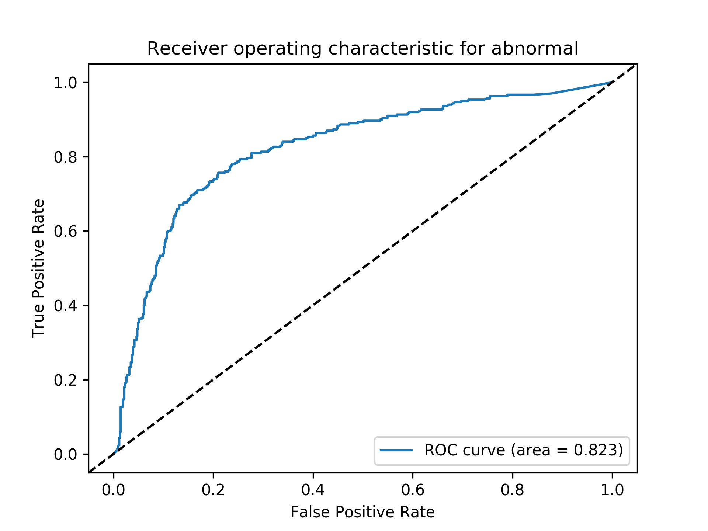
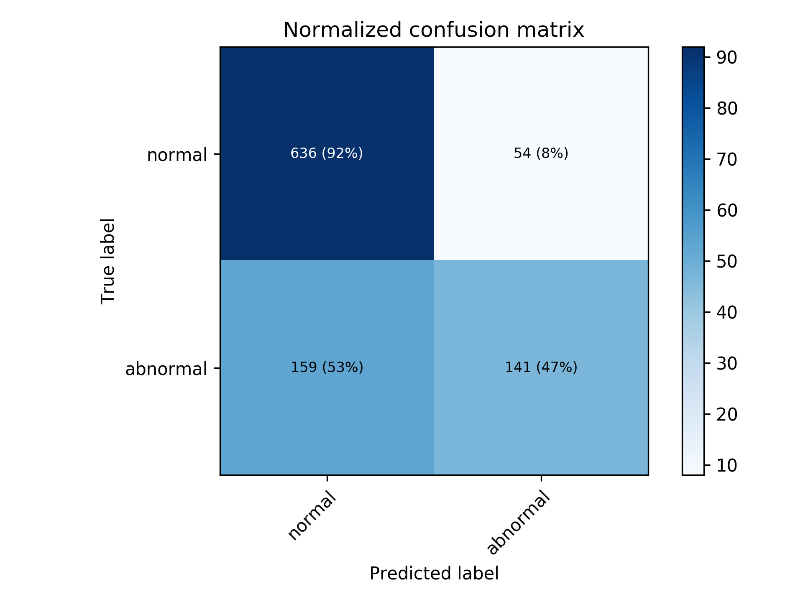

# Unet based Classification for medical felid

This repository shows experimental reuslt for medfcal domain of classification. If a model can generates image well, features in the model can improve classification performance and utilizing all levels of feature is useful in terms of classification performance.

## Requirements
* python3.6+
* pytorch 1.6.0
* others.

## Usage
training a model
```bash
python3 main.py --config config.yml
```

testing a model
```bash
Not implmented yet
```
## Results



## Comments
 In medical feild, image ratio and size is important then Applicability is limited, In this experiment, x-ray scan is used and image size is too big. The model requires lots of memory and time. The last feature size is too small, This architevture is not good in terms of grad-cam. The performance is not good than the densenet, resnet etc... 
## Reference
1. unet : https://github.com/milesial/Pytorch-UNet
2. spectral normalization : https://github.com/christiancosgrove/pytorch-spectral-normalization-gan/blob/master/spectral_normalization.py

